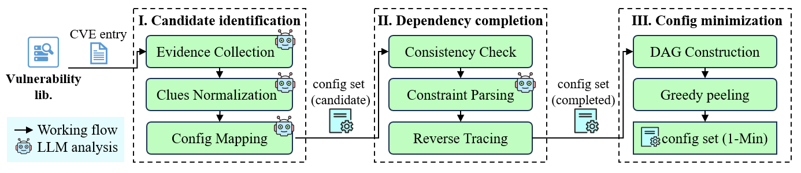

## FCC

Inferring 1-Minimal Trigger Configurations for Assessing Linux Kernel CVE Triggerability

## Overview

This repo offers FCC, an LLM-powered framework that links vulnerability cues to build-system symbols to mine candidates, completes implicit prerequisites under olddefconfig feedback to avoid silent rollback, and performs runtime-validated mini mization guided by the inferred dependency topology. 



## Setup

Create a virtual environment and install the libraries:

```
python -m venv .venv
source .venv/bin/activate
pip install -r requirements.txt
```

## How to Run

Before running the FCC, create and configure the `config.json` file:

```json
{
  "api_key_file": "./api_key.json", # Path to the JSON file containing API keys
  "base_url": "https://api.openai.com/v1", # LLM API endpoint URL
  "model": "xxx", # Replace with your OpenAI API key
  "max_threads": 4, # Default max threads for concurrent tasks
  "source_code_url": "https://mirrors.tuna.tsinghua.edu.cn/kernel/v{version_part}.x/linux-{version}.tar.xz"  # Kernel download URL template with {version} and {version_part} placeholders
  "nvdlib_api_key": "xxx"  # 
}
```

Create the `api_key_file` file referenced in `config.json`. Provide at least one API key.

```json
[
  "your_api_key_1_here",  # Replace with your OpenAI API key
  "your_api_key_2_here",
    ...
]
```

**Single CVE Mode.** For testing a single CVE, you must provide the kernel version via `--version` (optional if kernel source already exists), the QEMU environment path via `--qemu-dir`, and the POC execution command via `--exp-name`. 

For example: 

```shell
python main.py -t CVE-2021-22555 --version 5.11.14 --qemu-dir ./CVE-2021-22555 --exp-name "./poc"
```

**Batch Mode.** For testing multiple CVEs, provide an Excel file containing the required columns: `cve` for the CVE identifier (e.g., `CVE-2021-22555`), `version` for the kernel version (e.g., `5.11.14`), `exp_name` for the POC execution command, and `qemu_dir` for the QEMU environment path.

For example: 

```shell
python main.py -f ./data/cve_list.xlsx --threads 4
```

**Important Notes**

1. **Multi-threading Requirement**: Ensure the number of API keys in `api_key_file` is **greater than or equal to** the `--threads` value.
2. **Kernel Auto-Download**: If `--kernel-dir` is not provided and the kernel source is missing, the tool automatically downloads it using the URL template in `config.json`.
3. **Kernel Compilation**: Kernel compilation is related to tool versions. It is recommended to use GCC 8.4.0 and above, as well as binutils 2.30 and above.、
4. **QEMU Startup**: For some older Linux kernel versions, certain configuration items (e.g., `CONFIG_KASAN`) must be disabled to ensure normal QEMU startup.

## Repository Structure

* `/Stage1`: This folder contains code files for the **Candidate Identification** stage.
  `Candidate_Identification.py` identifies potential vulnerable configuration candidates from vulnerability artifacts (e.g., NVD reports, patches, PoCs, and references).

- `/Stage2`: This folder contains code files for the **Dependency Completion** stage.
  `Dependency_Completion.py` automatically finds and completes missing kernel configuration dependencies through LLM-powered analysis of Kconfig and Makefile snippets.
- `/Stage3`: This folder contains code files for the **Config Minimization** stage. 
  `Config_Minimization.py` reduces the completed configuration set to a 1-Minimal config set — the smallest subset that still enables the target vulnerability.
- `/utils`: This folder contains utility code files providing common operations such as source code download, command execution, configuration loading, web crawling, and API management.
- `/patches`:  This folder contains patches applied to the kernel source code. These patches are used to fix compilation errors in older kernel versions or to remove restrictions during vulnerability exploitation.

#### Dataset

- `/data`: This is a data storage folder containing the minimal configuration item sets for 88 CVEs in total from the KernJC and KernelCTF datasets, along with other data files (e.g., configuration sets generated by the KernJC method and our method).
